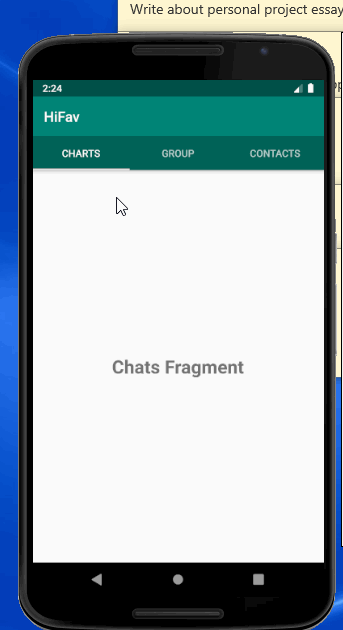
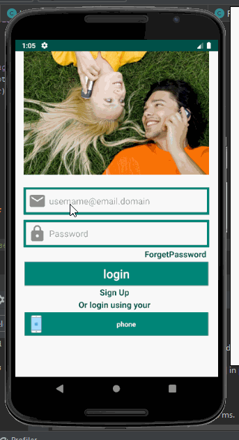
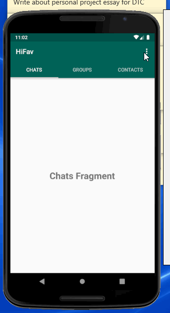
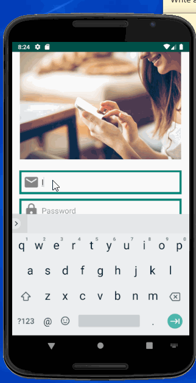
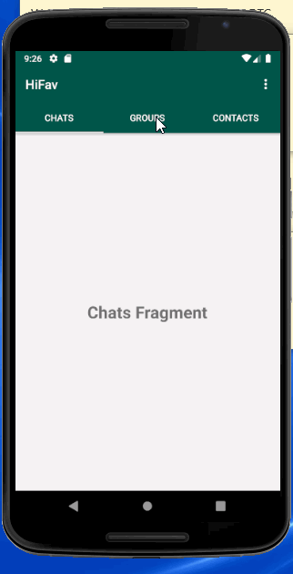

# HiFav

HiFav is a Social Chat Android app built to connect you to everyone you love.

## By [**Linus Brian Okoth**](https://www.linkedin.com/in/linus-okoth-273b12143/)

For any bugs or messages drop me an [email](<mailto:brianlinus1753@gmail.com>)

## Methodology
I will display any progress in the chronological order in which they were implemented and I will also give a brief explanation on
whatever the features I am implementing.

## Requirements:
- Download and Install ***AndroidStudio 3.5*** or later versions.
- Start an Empty project with _API level 28_ or later versions.
- Confirm support for latest ```androidx``` libraries

## Configuration
The app will be running on data as different users will be sending messages to other users. Thus I chose a database that can easily
facilitate this process as follows: 
-  I added Firebase Access Control through the built in ***assistant*** in Android studio. First you have to log into android studio
then using the assistant bar add access and Authentication by Firebase.
- Click on add Google cloud storage to the app. 

### _Common Bugs_ 
***Firebase connection failed*** - This is caused either caused by poor internet connection which can be solved by accessing a stronger 
internet connection or, if the account signed into your Android Studio account is not a gmail account. In that case you need to switch
to a gmail account. 

***Build Graddle Failed*** - This is mostly as a result of difference in your graddle app version and the just added Firebase version
which can also be solved by opening graddle app file and updating your dependency to the required version.

## Functionality and Major Features

## Custom TaskBar

### Implementation Specifics
-  Open your style folder and create a customized style of choice. Then create a new layout with the ```root element``` as the toolbar.
- In this project we will be automatically choosing ***Relative Layout**
-  Set the properties in your new layout including adding the background color and setting the layout height to wrap content.
- It advisable that throughout this project you give every new element added an inituitive id that matches what it performs or
the functions of the library it implements.
- Include your layout in ```activity_main.xml``` since thats the main xml page being rendered when oncreate in the
```MainActivity.java``` is invoked when your app runs. It defines the landing page in other words. You will need to
use the ```<include></include>``` tag and call your layout between them.
- Include the toolbar in  ```MainActivity.java``` by creating a new instance of the ```ToolBar``` class then setting the values
and rendering the bar with your custom name eg  ```
        setSupportActionBar(mToolBar);
        getSupportActionBar().setTitle("HiFav");```

### _Common Bugs_
***Instance of ```ToolBar``` not recognized*** Delete the import line for the ```ToolBar``` and use the autophelp to import
a matching version.

## TabLayout to that switches between different fragments.
-  Define the ```appBarlayout``` in the ```activity_main.xml``` as a container and cut the previously defined ```<include></include>```
inside them
- Most importantly add the ***view_property*** just below and outside the ```appBarLayout```. 
- Then create three fragments that will be represented on the ```MainActivity.java```
- Currently we are presented with a special case of three fragments that need to be read and rendered in ```MainActivity.java```, a 
class with absolutely no relation to these fragments. This is where we apply our ***Adapter knowlege*** to enable us collect location
from ```MainActivity.java``` and decide which fragement to be rendered. Thus we create a new class that extends Fragment Page Adapter,
the adapter for fragments. 
- Finally we go to ```MainActivity.java``` and instatiate Tabs access Adapter, the newly created class and pass the view page object
to configure swiped through different Tabs.

### _Common Bugs_
***App Crashes when you try to switch through different fragments*** Delete your fragments and recreate them while unchecking the 
checkboxes that request to set default functionalities for your fragments.

***Graddle Crash*** or ***Project cant access*** ```depreciated support:appcompativity.design``` add this line to your graddle
to use the updated version of the library ```implementation 'com.google.android.material:material:1.1.0'```

### _Demonstration of above implementations_

<br>


## Setting Up Authentication page

### Implementation Specifics

- Include ***firebase User*** tag in the ```Main_Activity``` then use the ```getinstance``` method to get an instance of your database
in its current state.
- Create asn ```OnStart``` method that checks if the current user is present is present in the database, else use the ***Intents*** to
forward them to to the ```Login_Activity```.
- Create ***drawables*** to style your ```Login_Activity``` and ```Register_Activity```. Style each corresponding ```.xml``` files and
then use ***intents*** and ***```setOnClickListeners```*** to switch between the different pages.

### _Common Bugs_
- ***Build Crash when Switching through Different Activities*** This may be caused by a misplaced id because at this stage you are 
required to create different elements and subsequently many ids that can easily get switched while passing an intent or cause an unpredicatable look in your UI.

## Adding Authentication Data and creating users in Firebase

### Implementation Specifics

- The input is collected from the ```Register_Activity.java``` and you should filter through to avoid missapropriation of your data by corrupted data. Thus set booelean checks for password length and set the user field to email to verify email. 
- Create a ***FirebaseAuth*** using the ***FirebaseAuth.getInstance*** to save the current state of your application database. 
- Add Data to ***Firebase*** using ```mAuth.createUserWithEmailAndPassword(email, password)``` with an optianal ```.addOnCompleteListener``` to check if the process was succesfull or to get exceptions that you can catch to retry adding the user in a more suitable way or display to the user using the ***Toast***.
- For a finer finishing, add the ***ProgressDisplay*** and make animations that connects the microseconds when the data is being 
sent to the ***Firebase*** servers.  Finally add intents to send back users to ```loginActivity``` after the process is completed.

### _Common Bugs_
***Failed to Authenticate the User Data*** This is specifically caused by Firebase being unable to receive user input due to restictions by the administrator. Login into your Online Firebase Account enable ***EmailandPasswordAuthentication*** while not enabling the email link authentication.

***Error Message*** ***```Emulator Trying to Erase a non-existent Color Buffer with Handle 0```*** This is has an unbounded range of possible causes, But your first step is check your ***logcat*** for any erroundous error message and the second most common solution is 
Increasing the RAM your emulator runs on. The exact implementation can be found [here](https://stackoverflow.com/questions/47739661/android-studio-emulator-and-process-finished-with-exit-code-0)

## Reading Authentication Data after creatin users in Firebase

### Implementation Specifics
- Start by creatingan instance of the ***Firebase-Auth*** in the ```Login_Activity```
- Set Onclick listeners for submit then verify the data in the following manner ```mAuth.signInWithEmailAndPassword(email, password)```.
- Just as the previous case, add ***Toasts*** and ***ProgressDisplays*** while running your database to communicate with your use on what the app is doing on any particular time. You could use the optional ```.addOnCompleteListener``` for more comprehensive feedbacks.
- Most Importantly add the ```FirebaseAuth.getCurrentUser``` in both the ```Main_Activity``` and ```Login_Activity``` to ensure that once the user logs in during app installation they are never prompted to login againby checking if the ```currentuser``` matches the ```FirebaseAuth.getCurrentUser``` and thus they are not redirected from ```Main_Activity``` to ```Login_Activity``` as the landing page.

### _Common Bugs_

***User Doesnt exist in database*** Confirm that you are not using any depreciated Firebase libraries to access your data. Otherwise add the following to your app graddle environment ****```implementation 'com.google.firebase:firebase-auth:19.3.0'``` and 
 ```implementation 'com.google.android.gms:play-services-auth:17.0.0'```****. Then use the following to parse your details ```mAuth.signInWithEmailAndPassword(email, password)```.
  
 ### _Demonstration of above implementations_

<br>

## Distinguishing users and Managing user data.

## 1. Adding drop down Menu to handle Logout in UI.

### Implementation Specifics
 -  We create a new ***Android Resource Directory*** with specific type of Menu and style the ```mainActivity.xml``` ensuring the ```showAsAction``` on the menu is set to never
 -  In the ```MainActivity.java``` add a method ```onCreateOptionsMenu``` to find out if any of the options in the Menu has been clicked.Inside the check conditional statement for Logout, use the firebase instance ***mAuth*** to signout the user and use the previously defined method ***sendUsertoLoginActivity***.
 
## 2. Handling Creation of different users

### Implementation Specifics
- Go to ***android manifest*** and add user permission to request use of the internet.
- Add in the ```registerActivity.java``` and the ```loginActivity.java``` the attribute ***MainIntent.addFlags(Intent.FLAG_ACTIVITY_NEW_TASK | Intent.FLAG_ACTIVITY_CLEAR_TASK)*** in their ```sendUserToMainActivity``` methods
and finally ```finish()```. This is to prevent the user from pressing the back button and being redirected to either ```loginActivity``` or ```RegisterActivity``` after they complete these actions.
- Using the ***DatabaseReferrence*** We are going to add unique user id to the database for each user that logs in. Go to the ```Firebase ```  and click on the database section and create a real time database in the test mode to allow reading and writting by the users.
- Using the instance of the ***DatabaseReferrence*** in  ```registerActivity.java``` we can create unique users everytime we get a new signup by: ```RootRef.child("Users").child(currentUserID).setValue(" ")```

### _Common Bugs_
***Error reading or configuring your firebase database*** This can be solved by deleting all the existing users. Then remove the previously wirtten code in ```LoginActivity``` and ```RegisterActivity``` such that the ```onStart``` methods in these files dont check if the current user is logged in. We will do that only in ```MainActivity.java``` since thats the landing page and ideally we wont render the ```LoginActivity``` and ```RegisterActivity``` unless the user logouts.

 ### _Demonstration of above implementations_

<br>


## Updating Name and status just after Account Creation

- Create a new ```SettingsActivity```. Import the ***CircleImageView*** from [here](https://github.com/hdodenhof/CircleImageView) by copying the following dependecies line ```implementation 'de.hdodenhof:circleimageview:3.1.0'``` and adding it to your graddle app.
- Style your ```Activity_settings.xml``` in accordanve to this [documentation](https://github.com/hdodenhof/CircleImageView).
- Create a method ***VerifyIfUserExist*** in the ```MainActivity``` that is called ```onStart``` to determine if this is a new or old user. If its a new user send them to the ```SettingsActivity``` so they can add the ***mandatory*** names and status and ***optional*** profilePicture. 
- Create a String ```Hashmap``` and store the user input details into your database through the ```FirebaseDatabase().getInstance().getReference``` object.

### _Common Bugs_
***Civ-border-colour not responsive*** Change the border coloring from a ```primarycolor``` component to a ```colorprimary``` component.
***Problems loading the Circle Image View*** View this list of [FAQs](https://github.com/hdodenhof/CircleImageView) for a possible solutions.
***Error identifying or adding user in the database*** Ensure you check for consistency in variable ```name``` used to identify the user in the databse. Also check if the variable naming is consistentb in the HashMap.
***The SettingsActivity does not load the MainActivity after the user details are input*** Set the subchild intermediarry while accessing the database using the ```FirebaseDatabase().getInstance().getReference``` object while verifying the user Existence.

 ### _Demonstration of above implementations_
 
<br>

## Handling Groups
- Retrieve the previous username and status by reading through the databse by a ```rootref``` instance of ```firebasedatabasereferrence```
- Create a ```requestNewGroup``` Method and use a builder to create an alert when the user prompts the creation of the new group.
- Read data from the database child ```group``` section and and Display them to the groupFragment with a ``styleList```.
- Create an ```OnItemclickListener``` for each group in the array to transfer the name to the ```newGroupChatActivity``` using the intent.

### _Common Bugs_ 
***List of Group is duplicated every time you add a new group*** Create a ```hashset```. Using an ```iterator``` get the ```primarykeys``` which is the group name and add them to the hashset. Finally display the items in the ```hashset``` in the scrollable 
layout with nested list.

 ### _Demonstration of above implementations_

<br>


## License

    Copyright (c) 2020 Linus Brian Okoth

    Licensed under the Apache License, Version 2.0 (the "License");
    you may not use this file except in compliance with the License.
    You may obtain a copy of the License at

        http://www.apache.org/licenses/LICENSE-2.0

    Unless required by applicable law or agreed to in writing, software
    distributed under the License is distributed on an "AS IS" BASIS,
    WITHOUT WARRANTIES OR CONDITIONS OF ANY KIND, either express or implied.
    See the License for the specific language governing permissions and
    limitations under the License
